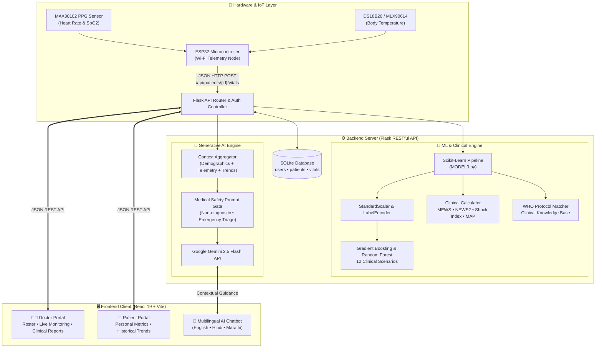
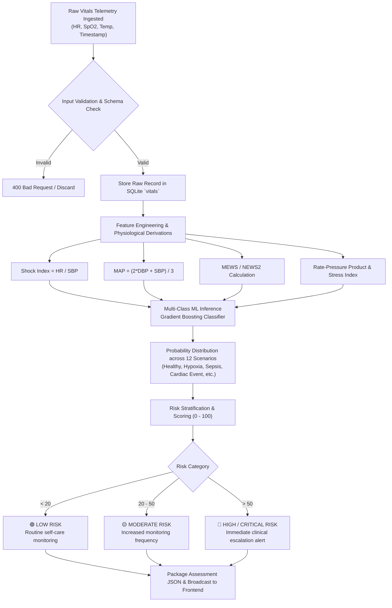
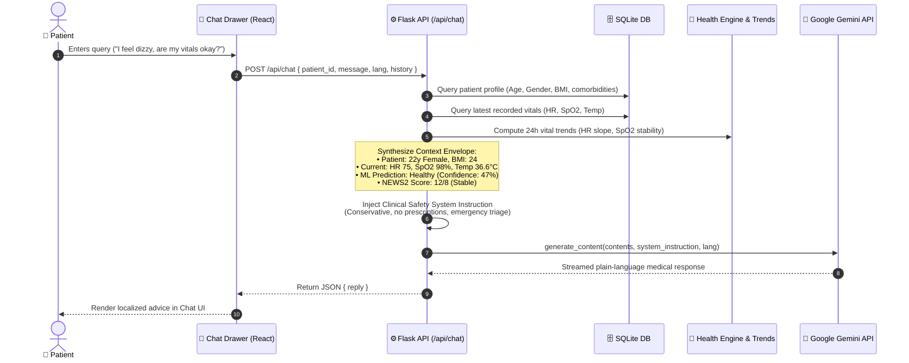

<div align="center">
  # ⚡ PulseForge — Smart User Monitoring System
  
  **Real-Time Vitals Telemetry • Multi-Class ML Risk Stratification • Context-Aware Gemini AI Assistant**

  <p align="center">
    <a href="https://pulseforge-divyani22.vercel.app" target="_blank">
      
    </a>
    <a href="https://frontend-divyani22.vercel.app" target="_blank">
      
    </a>
  </p>

  [](https://reactjs.org/)
  [](https://vitejs.dev/)
  [](https://tailwindcss.com/)
  [](https://flask.palletsprojects.com/)
  [](https://python.org)
  [](https://deepmind.google/technologies/gemini/)
  [](https://www.espressif.com/)

</div>


## 📑 Table of Contents
- [✨ Key Features](#-key-features)
  - [🧑‍⚕️ Doctor Portal](#️-doctor-portal)
  - [🤒 Patient Portal](#-patient-portal)
  - [🤖 Floating AI Health Assistant](#-floating-ai-health-assistant)
- [📸 Application Walkthrough & Screenshots](#-application-walkthrough--screenshots)
- [🏗️ System Architecture](#️-system-architecture)
  - [1. End-to-End System Topology](#1-end-to-end-system-topology)
  - [2. Real-Time Vitals & ML Risk Pipeline](#2-real-time-vitals--ml-risk-pipeline)
  - [3. Context-Aware AI Chatbot Reasoning Pipeline](#3-context-aware-ai-chatbot-reasoning-pipeline)
- [🧠 Machine Learning & Clinical Risk Engine](#-machine-learning--clinical-risk-engine)
- [🔌 Hardware & IoT Telemetry Architecture](#-hardware--iot-telemetry-architecture)
- [🛠️ Technology Stack](#️-technology-stack)
- [🚀 Quickstart & Setup Guide](#-quickstart--setup-guide)
  - [Prerequisites](#prerequisites)
  - [1. Backend Setup](#1-backend-setup-python--flask)
  - [2. Frontend Setup](#2-frontend-setup-react--vite)
  - [3. Hardware Setup (Optional ESP32)](#3-hardware-setup-optional-esp32)
- [📡 API Reference](#-api-reference)

---

## ✨ Key Features

### 🧑‍⚕️ Doctor Portal
* **Intelligent User Triage:** Unified roster displaying all assigned users with immediate AI-calculated Risk Levels (Low, Moderate, High, Critical) and NEWS2 scores.
* **Live Telemetry & Temporal Trends:** Real-time stream visualization with interactive Recharts charting Heart Rate, Blood Oxygen (SpO2), and Temperature over time.
* **Automated Clinical Diagnostic Reports:** One-click generation of comprehensive medical assessment reports detailing differential diagnosis probabilities, hemodynamic derivations (Shock Index, Mean Arterial Pressure, Rate-Pressure Product), and WHO clinical protocols.
* **Continuous Monitoring & Telemetry Linking:** Integration with ESP32 devices via user identification codes and remote Wi-Fi configuration.

### 👤 User Portal
* **Personalized Health Dashboard:** Clean, intuitive interface displaying live vital metrics, status indicators, and historical recovery/stability trends.
* **Predictive Early Warning:** Immediate visual feedback when vitals deviate from baseline, empowering users to seek timely intervention.
* **Automated Health Assessment:** Self-service diagnostic summaries explaining current vital stability in plain, reassuring language.

### 🤖 Context-Aware AI Health Assistant
* **Context-Grounded Medical Intelligence:** Powered by Google Gemini, the chatbot injects the user's age, BMI, comorbidities, latest vitals, and 24-hour temporal slope directly into the reasoning prompt.
* **Multilingual Interaction:** Communicates fluidly in **English**, **Hindi (हिंदी)**, and **Marathi (मराठी)** based on user preference.
* **Clinical Safety Guardrails:** Strict conservative medical prompting prevents hallucinated diagnoses, refuses unauthorized drug prescriptions, and provides immediate emergency triage protocols.

---

## 📸 Application Walkthrough & Screenshots

### 1️⃣ Intelligent Doctor Dashboard
High-level operational overview for physicians, showcasing assigned patient rosters, risk categories, and direct clinical action shortcuts.

<div align="center">
  
</div>

<br/>

### 2️⃣ Patient Detail & Live Monitoring
Detailed patient inspection view featuring real-time vital gauges, historical multi-metric temporal graphs, and physiological trend trajectories.

<div align="center">
  
</div>

<br/>

### 3️⃣ AI Predictive Clinical Diagnostic Report
Automated clinical report summarizing multi-class ML classification, probability distributions, MEWS/NEWS2 scores, and WHO self-care guidance.

<div align="center">
  
</div>

<br/>

### 4️⃣ Dedicated Patient Portal Dashboard
Patient-facing interface providing personal health tracking, vital sign summaries, trend indicators, and access to their full clinical report.

<div align="center">
  
</div>

<br/>

### 5️⃣ Context-Aware AI Medical Assistant (Chatbot)
Floating conversational agent capable of analyzing live telemetry and delivering immediate, conservative guidance tailored to the patient's status.

<div align="center">
  
</div>

<br/>

### 6️⃣ Authentication & Access Gate
Role-based portal with streamlined login, multi-factor verification, and registration for both doctors and patients.

<div align="center">
  
</div>

---

## 🏗️ System Architecture

### 1. End-to-End System Topology



---

### 2. Real-Time Vitals & ML Risk Pipeline



---

### 3. Context-Aware AI Chatbot Reasoning Pipeline



---

## 🧠 Machine Learning & Clinical Risk Engine

The intelligence layer combines rule-based clinical early warning scores with supervised machine learning:

| Component | Specification | Description |
| :--- | :--- | :--- |
| **Model Algorithm** | Gradient Boosting & Random Forest | Multi-class classification trained on comprehensive physiological datasets. |
| **Classified Scenarios** | 12 Clinical Conditions | `healthy`, `hypoxia`, `fever`, `asthma_exacerbation`, `copd_exacerbation`, `heart_failure`, `sepsis`, `respiratory_distress`, `cardiac_event`, `hypertension_crisis`, `pneumonia`, `critical`. |
| **Hemodynamic Derivations** | MEWS & NEWS2 | Modified Early Warning Score & National Early Warning Score 2 composite calculations. |
| **Cardiovascular Proxies** | Shock Index, MAP, RPP | Non-invasive derivation of Shock Index ($SI = \frac{HR}{SBP}$), Mean Arterial Pressure ($MAP$), and Rate-Pressure Product. |
| **Clinical Guidelines** | WHO Self-Care 2019 | Standardized, evidence-based triage and self-care steps matched to active scenario. |

---

## 🔌 Hardware & IoT Telemetry Architecture

The system supports real-time hardware telemetry transmission from portable edge devices:

* **Microcontroller:** ESP32-WROOM-32 (Dual-core 240MHz, 2.4GHz Wi-Fi + BLE).
* **PPG Pulse Oximeter:** MAX30102 optical sensor (I2C address `0x57`) measuring real-time Photoplethysmogram waveforms for Heart Rate & SpO2.
* **Temperature Sensor:** DS18B20 1-Wire digital probe or MLX90614 infrared ambient/skin sensor.
* **Firmware:** Arduino/C++ (`sketch_oct4a/sketch_oct4a.ino`) with automated Wi-Fi reconnect and JSON serialization.

```
[ MAX30102 PPG ] --- (I2C: SDA/SCL) ---> [ ESP32 MCU ]
[ DS18B20 Temp ] --- (1-Wire: GPIO) ---> [ ESP32 MCU ]
                                               |
                                        (Wi-Fi 802.11 b/g/n)
                                               |
                                               v
                                [ Flask API: /api/patients/{id}/vitals ]
```

---

## 🛠️ Technology Stack

| Layer | Technologies |
| :--- | :--- |
| **Frontend Framework** | React.js 19, Vite 8, React Router 7 |
| **Styling & UI** | TailwindCSS 4, Lucide React Icons |
| **Data Visualization** | Recharts 3 (Interactive Time-series Area & Line Charts) |
| **Backend Framework** | Python 3.10+, Flask RESTful API, Flask-CORS |
| **Machine Learning** | Scikit-Learn, Pandas, NumPy, Joblib |
| **Generative AI** | Google Generative AI SDK (`google-genai`), Gemini 2.5 Flash |
| **Database** | SQLite3 with Thread-safe Connection Pools |
| **Hardware** | ESP32, MAX30102 (PPG), DS18B20/MLX90614 |

---

## 🚀 Quickstart & Setup Guide

### Prerequisites
- **Node.js**: v18.0.0 or higher
- **Python**: v3.10 or higher
- **Google Gemini API Key**: Obtain from [Google AI Studio](https://aistudio.google.com/app/apikey)

### 1. Backend Setup (Python / Flask)
```bash
# Clone the repository
git clone https://github.com/divyani-22/Cep-project.git
cd Cep-project/backend

# Create and activate virtual environment
python -m venv venv
# On Windows:
venv\Scripts\activate
# On Linux/macOS:
source venv/bin/activate

# Install dependencies
pip install -r requirements.txt

# Configure your Gemini API Key
# Create a .env file in the backend directory:
echo GEMINI_API_KEY=your_gemini_api_key_here > .env

# Initialize database and start Flask API server
python app.py
```
*Backend runs on `http://localhost:5000`*

### 2. Frontend Setup (React / Vite)
```bash
# In a new terminal window, navigate to frontend:
cd Cep-project/frontend

# Install dependencies
npm install

# Start Vite development server
npm run dev
```
*Frontend runs on `http://localhost:5173`*

### 3. Hardware Setup (Optional ESP32)
1. Open `sketch_oct4a/sketch_oct4a.ino` in Arduino IDE.
2. Install `SparkFun MAX3010x Pulse and Proximity Sensor Library` and `OneWire` / `DallasTemperature`.
3. Configure your local Wi-Fi SSID, Password, and Backend host IP (`http://<YOUR_PC_IP>:5000/api/patients/<ID>/vitals`).
4. Flash the code to your ESP32 board.

---

## 📡 API Reference

| Method | Endpoint | Description |
| :--- | :--- | :--- |
| `POST` | `/api/auth/login` | Authenticate user (Doctor or Patient) |
| `POST` | `/api/auth/register` | Register new clinician or patient account |
| `GET` | `/api/doctors` | List all registered doctors |
| `GET` | `/api/patients` | List patients linked to authenticated doctor |
| `GET` | `/api/patients/<id>` | Fetch detailed patient profile and recent vitals |
| `POST` | `/api/patients/<id>/vitals` | Ingest new physiological telemetry reading |
| `GET` | `/api/patients/<id>/vitals` | Query historical time-series vitals readings |
| `GET` | `/api/patients/<id>/trends` | Compute temporal slope and stability indicators |
| `GET` | `/api/patients/<id>/report` | Generate comprehensive AI diagnostic clinical report |
| `POST` | `/api/chat` | Send conversational prompt to context-aware Gemini AI assistant |
| `GET` | `/api/health` | Health check endpoint and ML model status |

---

<div align="center">
  <b>Built with ❤️ for the future of connected and proactive healthcare.</b>
</div>
